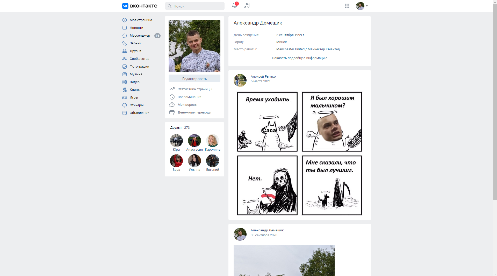

# VKontakte Profile Page Clone Using Bootstrap

## Assignment

Create a page similar to the "My Page" section in VKontakte (VK) using Bootstrap. This page should replicate the basic layout and design of a social media profile page. The goal is to practice working with Bootstrap components and to understand how to create responsive web pages.

## Project Description

This project is a simple clone of the VKontakte profile page built using HTML and Bootstrap. The project aims to demonstrate basic web development skills and the ability to structure a webpage using the Bootstrap framework for layout and styling.

### Features:

- **Responsive Layout**: The page adapts to different screen sizes (desktop, tablet, mobile) using Bootstrap's grid system.
- **Profile Section**: Displays profile picture, name, and basic personal information.
- **Navigation Bar**: Simulates the VK navigation menu with links for "My Page", "Friends", "Photos", etc.
- **Post Section**: A static section representing recent posts or updates from the user.
- **Friends Section**: Displays a few example "friends" using Bootstrap cards.

Here is a screenshot of the final implementation:

  

### Technologies Used:

- **HTML5**
- **CSS3**
- **Bootstrap 5**
- **IntelliJ IDEA** (as the code editor)
